# ProjetoElite

## 1. Apresentação 
Elite é um projeto que visa fazer uma ponte entre prestadores de serviço e seus clientes, através de um catalógo de microprestadores de serviço disponível
no aplicativo, e no qual, é possível cadastrar sua microempresa através do nosso site. 

## 1.1. Atualização
Este foi um projeto de conclusão de curso na instituição ETEC, dentro do curso técnico de Desenvolvimento de Sistemas. O trabalho foi um sucesso e conseguiu nota máxima com a banca.

## 2. Dependências

node v16.13.0
expo v6.0.6
docker v23.0.6
docker-compose v1.29.2

o resto das dependências você pode baixar usando seu gerenciador de módulos dentro de cada setor desse repositório (backend, web, mobile). Geralmente será o npm ou yarn.

### 2.1. Rede

EliteApp/config/network.js
EliteSite/src/config/network.js

ajuste de acordo com o seu IP local

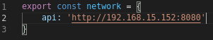

### 2.2. Mysql Statement:

é necessário executar este comando para que tudo ocorra certo.

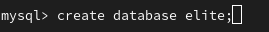

### 2.3. Variáveis de Ambiente e configuração das models

Para configurar as variáveis de ambiente em ./backend, renomeie o arquivo example.env para .env e preencha as variáveis necessárias como MYSQL_PASSWORD e JWT_KEY.

Em *todos os models presentes na API há alguma destas seguintes linhas comentadas:

//db.sequelize.sync({force: true}) 
ou
//<Nome da Model>.sync({force: true});

Para que tudo ocorra certo no banco de dados é necessário que você apague esta linha de cada um e utilize o comando "node <Nome do arquivo>", logo após isso comente a linha novamente.

A ordem pra executar os arquivos é:

node Microempresas

node Avaliacao

node Cliente

node createComentarios (este é o único arquivo que não possue essa linha comentada então apenas execute ele)

### 2.4. SITE

na pasta ".EliteSite/" execute: "npm install" e depois "npm start" para rodar o site na porta 3000

## 3. Demonstrações

### 3.1. APP
  
  #### 3.1.1 Tela de Início
  
  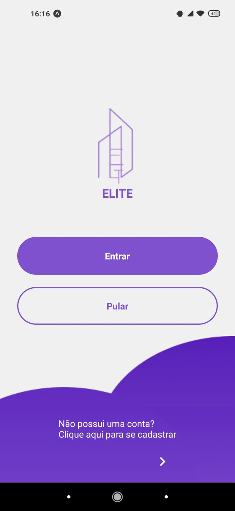
  
  #### 3.1.2 Cadastro
  
  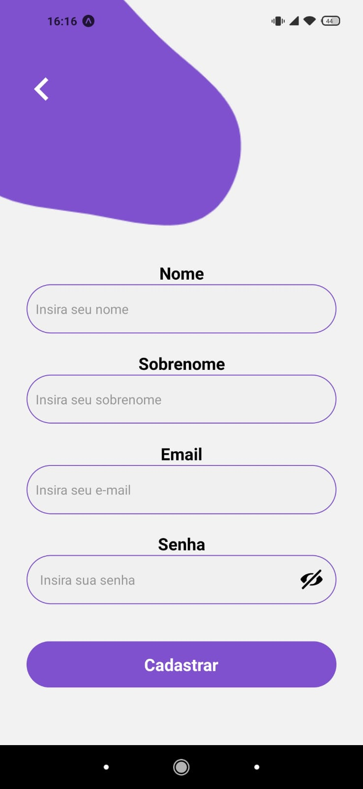
  
  #### 3.1.3 Categorias
   
  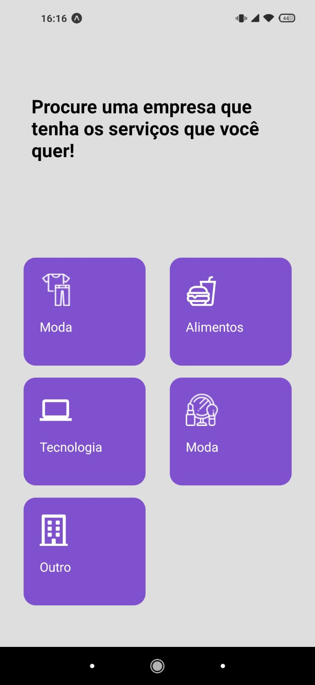
  
  #### 3.1.4 Home
  
  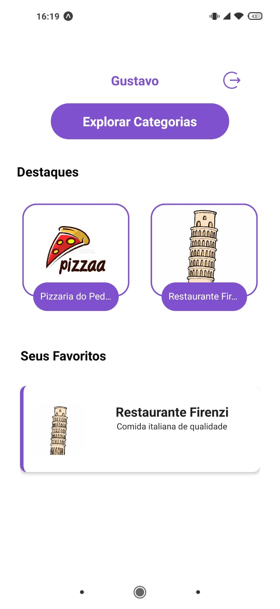
  
  #### 3.1.5 Busca
  
  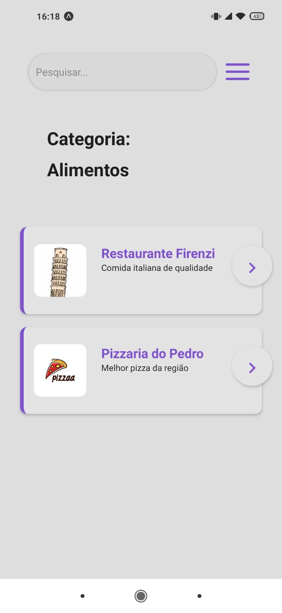
  
  #### 3.1.6 Detalhes da Empresa
  
  
  
  #### 3.1.8 Comentários
  
  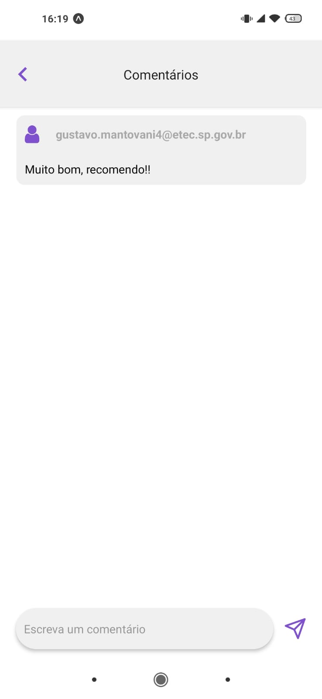
 
### 3.2 SITE
  
  #### 3.2.1 Tela Inicial
  
  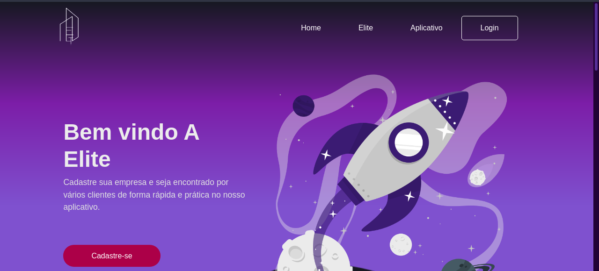
  
  #### 3.2.2 Cadastro
  
  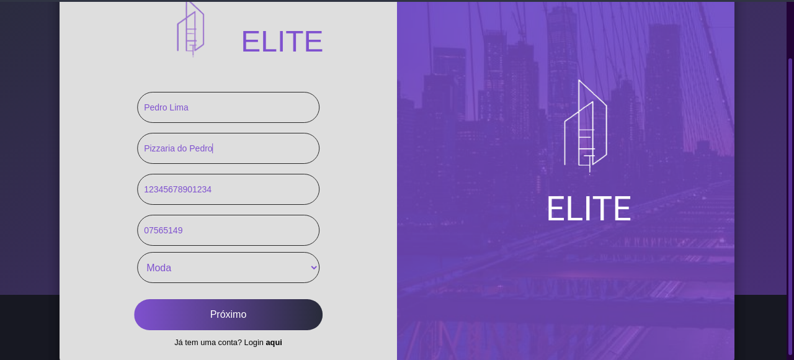
  
  #### 3.2.3 Info da Empresa
  
  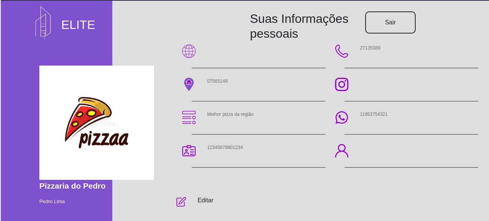
